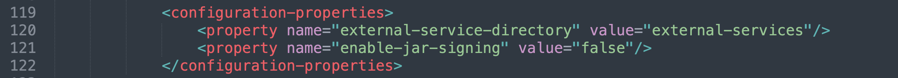
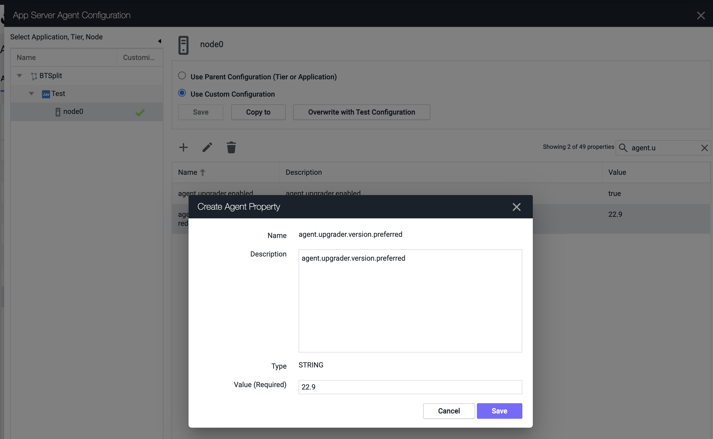
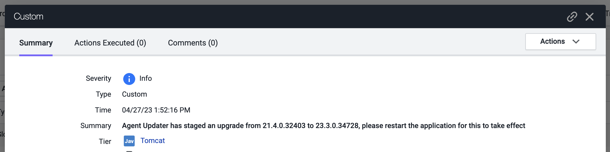
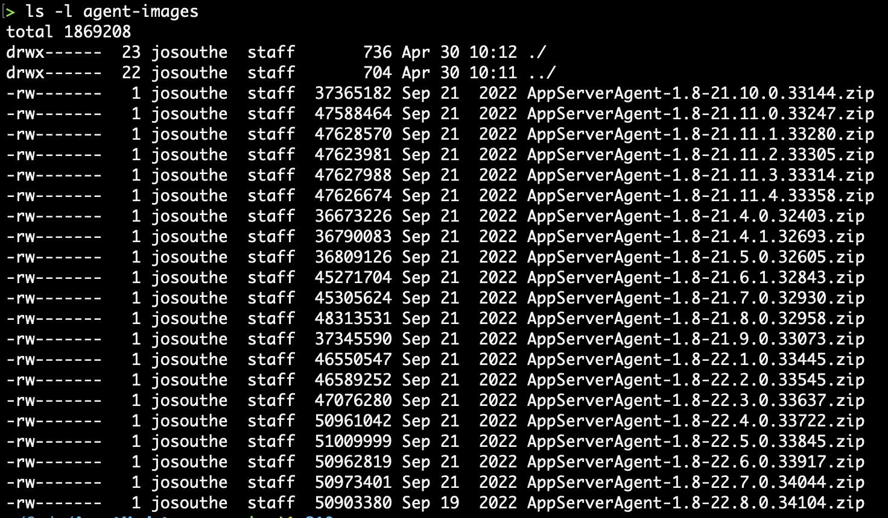

# AppDynamics Java Agent Upgrade Dynamic Service Extension

 
[Github Link To This Repo](https://github.com/jbsouthe/AppDynamicsAgentUpdater)

This extension allows the AppDynamics Java Agent to upgrade itself. Ironically, it does not yet install itself, but once installed you can control it via node properties set at the Controller UI.

This plugin is in BETA and not supported by AppDynamics, please report any issues to this github repository and our team will respond as soon as possible.
Thanks, John

## Theory of Operation "how does it work"

The agent dynamic service needs to be installed and then node properties from the Controller UI will dictate how it acts
setting the following will cause it to perform the updates. The service will run and check for upgrades every 3 minutes, so when changing these parameters make sure to allow time to see execution.

    "agent.upgrader.enabled" - boolean, setting this to true causes this service to come alive
    "agent.upgrader.version.max" - highest agent version to go to
    "agent.upgrader.version.min" - lowest agent version to maintain
    "agent.upgrader.version.preferred" - the version we want to be at, "22.8" will grab the latest agent of that major and minor version, so if a hotfix is published, it will be applied.
    "agent.upgrader.version.current" - this is not used on the controller side, and i'm a bit annoyed that it isn't propogated from agent to controller, it is what it is
    "agent.upgrader.repo.url" - alternative download site to get agent files from, se la vie

## Installation - You only have to do this once

Some setup. This should be installed in the < agent install dir >/ver22.###/external-services/agent-updater directory
the < agent intall dir >/ver22.###/conf/app-agent-config.xml at line 120 has to have signing disabled in the "Dynamic Services" section:

    <configuration-properties>
        <property name="external-service-directory" value="external-services"/>
        <property name="enable-jar-signing" value="false"/>
    </configuration-properties>

Agents now will be downloaded from our download site, but if needed an alternative URL can be set which will instead attempt to download the file name from the root of the url

Still working out a few bugs, and making sure the logic handles everything so we don't try to upgrade twice, node properties seem to not be updatable from the node, so it is a one way control plane

## How to "do it"

Custom node properties control these activities. Setting the <B>"agent.upgrader.version.preferred"</B> node property will attempt to keep the agent at the version specified to the most significant part of the version entered. 
If you want to make sure you have the latest version for 2023, just enter "23", but if you want to make sure you have all the hot fixes or builds for April 2023, enter "23.4". Do not enter "24" if no releases exist for 2024, or the agent will not be upgraded until a release is available.

## Upgrade Confirmation "did it do it?"

Once the upgrade is complete, each node where it executed will send a custom event to the controller.

## Running a local download server "how to do it the hard way"

If your environment does not enjoy access to the AppDynamics agent download site on the world wide web, you can download agents or even custom agent deployments from a server you can have the joy of maintaining locally.

To execute this standalone server, you will need to run the following java command:

    java -Dserver-port=8080 -Dserver-directory=./agent-files -jar AgentUpdater.jar

### -Dserver-port
The port will support the listing and download commands that the agents will use, remember of course to set the node property <B>"agent.upgrader.repo.url"</B> will need to point to this new server. something like: "http://hostname:8080/"

### -Dserver-directory
The directory specified should contain files named with unique values of version files ending in \d+.\d+.\d+.\d+.zip ie: "AppAgent-23.1.0.1234.zip". My working test server has a directory that looks like this, if you get to something with this example you are doing pretty well.

## Running a local download server with SSL "how to do it even harder, grr"

For this I decided to support a property file, because you have to do all sorts of annoying things with TLS, because that false economy must be maintained. 
I'm going to provide notes to make it easier and keep it all secure, but if you need something even more crazy, seek therapy.

    #server port needs to be >1024 if not root, and should definitely be not root
    server-port=8000
    server-directory=.
    
    #ie: keytool -genkeypair -keyalg RSA -alias selfsigned -keystore testkey.jks -storepass password -validity 360 -keysize 2048
    useSSL=true
    sslContext=TLS
    keystoreInstance=JKS
    keystorePassword=password
    keystoreFile=testkey.jks
    keyManagerFactory=SunX509
    trustManagerFactory=SunX509
    
    #shouldn't need to mess with these, but just in case....
    threadPoolMaxSize=8
    threadPoolKeepAliveSeconds=30
    threadPoolCapacity=100

To run this more complex server version, you will need to create a configuration pointing to valid ssl keystore with a command like this:

    java -jar AgentUpdater.jar config.properties
